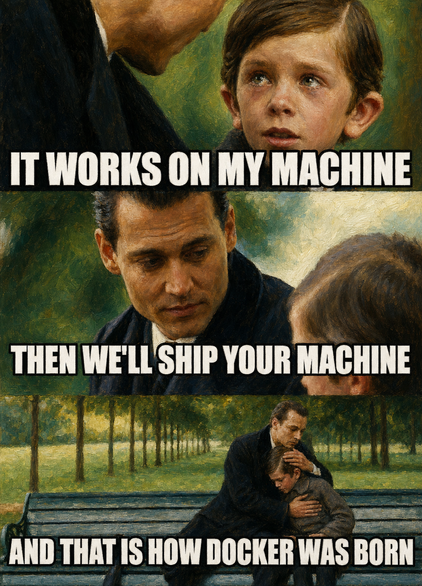

# Docker 101 Series for AI/ML Developers

This is the supporting repository for the Docker 101 series in [The AIOps
Newsletter](https://theaiops.substack.com/).

This Docker 101 series is based on my LinkedIn Learning course—[Docker for Local AI App Development: Build Lightweight, Containerized AI Applications](https://www.linkedin.com/learning/docker-for-local-ai-app-development-build-lightweight-containerized-ai-applications).

## Tutorials

| Tutorial | Article | Code |
| --- | --- | --- |
| **The Docker 101 Series for AI/ML Developers** | [Read the tutorial](https://theaiops.substack.com/p/why-aiml-developers-should-learn) | — |
| **Why AI Developers Should Learn Docker** | [Read the tutorial](https://theaiops.substack.com/p/why-ai-developers-should-learn-docker) | — |
| **How to Write Your First Dockerfile for FastAPI** | [Read the tutorial](https://theaiops.substack.com/p/how-to-write-your-first-dockerfile) | [code](https://github.com/RamiKrispin/docker-for-ai/tree/main/tutorials/03-fastapi-dockerfile)|
| **How to Build a Docker Image from a Dockerfile** | [TBD]() | [code](https://github.com/RamiKrispin/docker-for-ai/tree/main/tutorials/04-build-fastapi-image)|
| **How to Run a Docker Container from an Image** | TBD | TBD|

## License

This tutorial is licensed under a [Creative Commons
Attribution-NonCommercial-ShareAlike 4.0
International](https://creativecommons.org/licenses/by-nc-sa/4.0/) License.

See [LICENSE.md](LICENSE.md) for the repository-wide notice.
